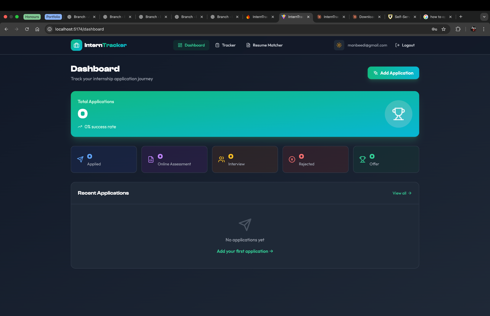
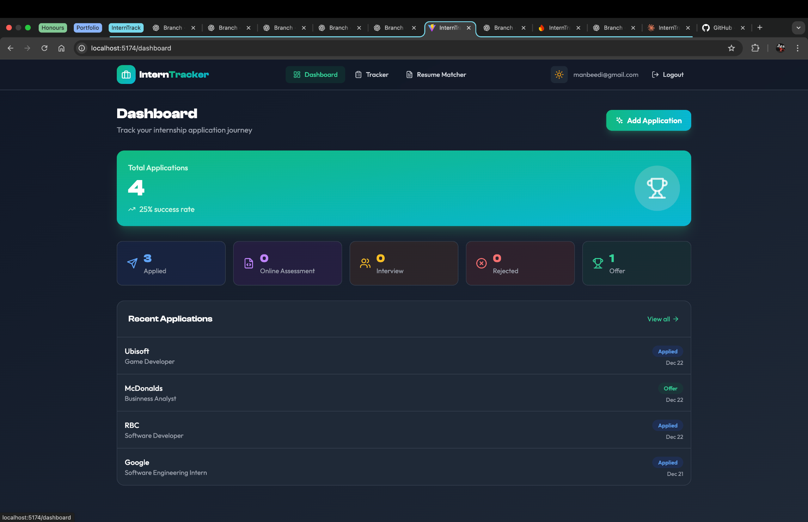
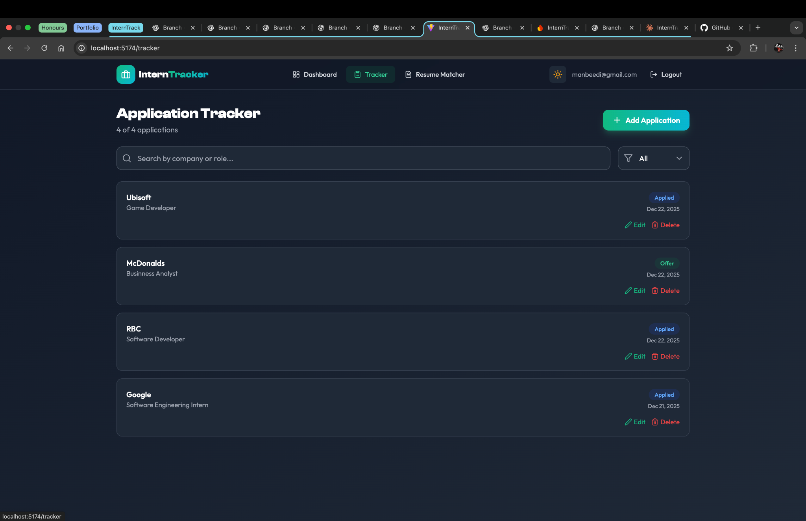
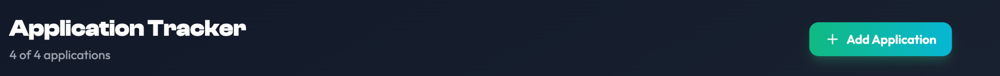
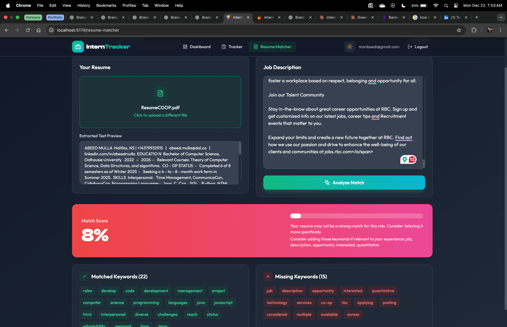

# InternTracker 

InternTracker is a web app I built to help students track internship applications and improve their resumes using keyword matching against job descriptions.

It combines an application tracker with a resume–job matching tool, so everything stays in one place during internship season.

---

##  Screenshots

### Dashboard

### Application Tracker

### Resume Matcher

---

## ✨ Features

###  Authentication
- Email/password login and signup
- User-specific data (each user sees only their own applications)

###  Dashboard
- Total applications count
- Status breakdown (Applied, OA, Interview, Rejected, Offer)
- Recent applications list

###  Application Tracker
- Add, edit, and delete internship applications
- Search by company or role
- Filter by application status
- Sort by most recent applications

###  Resume Matcher
- Upload a resume (PDF)
- Paste a job description
- See:
  - Match percentage
  - Matched keywords
  - Missing keywords with suggestions

###  UI & UX
- Dark mode
- Responsive design (desktop & mobile)
- Clean, modern layout

---

##  Tech Stack

- **Frontend:** React + Vite  
- **Styling:** Tailwind CSS  
- **Auth:** Firebase Authentication  
- **Database:** Cloud Firestore  
- **Resume Parsing:** pdf.js  
- **Icons:** Lucide React  

---

##  How It Works

### Authentication
Firebase Authentication handles signup and login.  
Once logged in, the user ID is used to scope all Firestore data.

### Firestore Data Model
Each user has their own applications stored like this:

